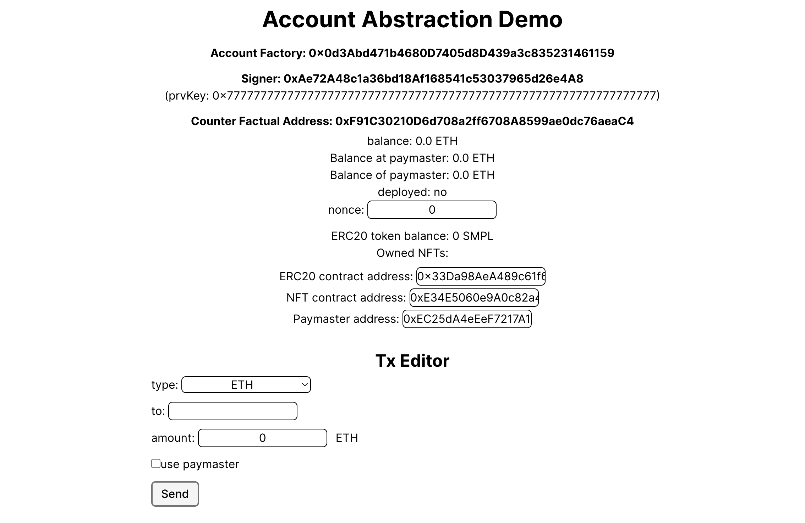

# sample-aa

Account Abstractionの動作理解のために作成

## 手順

### Rundlerイメージの作成

#### 1.開発用サーバーの用意

ローカルでも良いが、環境差の調整が面倒くさいので、Linuxサーバー上で実施（[container/](./container/)配下で以下コマンド実行）

```bash
cd container
cdk deploy
```

#### 2.開発用サーバーへの接続

* AWSのEC2コンソールを開き、構築したEC2を選択する
* 右上の「接続」メニューからSSH接続のメニューを開く
* SSMコンソールを起動する

#### 3.開発環境整備＆リポジトリ作成

[container/README.md](./container/README.md)に記載の手順に沿って、進める

### サーバーの起動（ECS on EC2）

[bundler_infra](./bundler_infra/)配下で、AWS CDKによりリソースを構築する

```bash
cdk deploy
```

※AWS CDKのバージョン

```bash
cdk --version
> 2.164.1 (build bb9275c)
```

### お試し用ガス代の用意

お試しするにあたりETHを任意のウォレットへ発行する

#### 1.Gethノードへの接続

* AWSのEC2コンソールを開き、Gethを起動しているEC2を選択する
* 右上の「接続」メニューからSSH接続のメニューを開く
* SSMコンソールを起動する

#### 2.Gethコンソールの起動

* 下記コマンドによりGethコンソールを開く
  
```bash
geth attach http://localhost:8545
```

#### 3.テスト用ETHの送金

* コンソール上で以下関数を実行してトークンを用意する（'0xf39....'の部分を使いたいウォレットのアドレスとする）

```bash
eth.sendTransaction({from: eth.coinbase, to: '0xf39....', value: web3.toWei(100, "ether")})
```

### お試し用スマートコントラクトのデプロイ

#### 1.RPC URLの設定

[hardhat.config.ts](./account-abstraction-webui-sample/hardhat.config.ts)を編集して、API GatewayのURLをRPC
のURLとして設定する

```typescript
...
  networks: {
    localhost: {
      url: "https://XXXX.ap-northeast-1.amazonaws.com/demo/geth",
      chainId: 1337,
      accounts: [process.env.PRIVATE_KEY as string],
    },
...
```

#### 2.コントラクトのデプロイ

以下デプロイコマンドでスマートコントラクトデプロイする

```bash
npx hardhat run src/scripts/setup.ts --network localhost

#以下出力結果
> Deploying the SimpleAccountFactory contract...
> SimpleAccountFactory deployed at: 0x9fE46736679d2D9a65F0992F2272dE9f3c7fa6e0
> Deploying the sample ERC20 contract...
> ERC20 contract deployed at: 0xCf7Ed3AccA5a467e9e704C703E8D87F634fB0Fc9
> Deploying the sample NFT contract...
> NFT contract deployed at: 0xDc64a140Aa3E981100a9becA4E685f962f0cF6C9
> Deploying the sample Paymaster contract...
> Paymaster contract deployed at: 0x5FC8d32690cc91D4c39d9d3abcBD16989F875707
> Staking 3 tokens for 90 days to paymaster...
> Sample ERC20 contract address: 0xCf7Ed3AccA5a467e9e704C703E8D87F634fB0Fc9
> Sample NFT contract address: 0xDc64a140Aa3E981100a9becA4E685f962f0cF6C9
> Sample Paymaster contract address: 0x5FC8d32690cc91D4c39d9d3abcBD16989F875707
> Done!
```

### お試し用Webアプリの起動

#### 1.環境変数の設定

[example.env](./account-abstraction-webui-sample/example.env)を編集して、前手順で構築した.envファイルを作成する

```text
COINMARKETCAP_API_KEY = ""
NEXT_PUBLIC_AA_RPC_ENDPOINT = "https://xxxxxx.ap-northeast-1.amazonaws.com/demo/rpc"
NEXT_PUBLIC_ETH_RPC_ENDPOINT = "https://xxxxxx.ap-northeast-1.amazonaws.com/demo/geth"
NEXT_PUBLIC_CHAIN_ID = 1337
PRIVATE_KEY = "0xac0974bec39a17e36ba4a6b4d238ff944bacb478cbed5efcae784d7bf4f2ff80"

NEXT_PUBLIC_ACCOUNT_FACTORY_ADDRESS = "0x9f..."
NEXT_PUBLIC_ERC20_CONTRACT_ADDRESS = "0xCf7E..."
NEXT_PUBLIC_ERC721_CONTRACT_ADDRESS = "0xDc..."
NEXT_PUBLIC_PAYMASTER_CONTRACT_ADDRESS = "0x5FC..."
```

#### 2.以下コマンドで起動する

```bash
npm run dev

> account-abstraction-webui-sample@0.1.0 dev
> next dev

  ▲ Next.js 13.5.6
  - Local:        http://localhost:3000
  - Environments: .env
```

[https://localhost:3000](http://localhost:3000)へWebブラウザでアクセスする



## 参考
* [Account Abstraction (ERC-4337) に触れてみよう ＜前編＞](https://gaiax-blockchain.com/erc4337-handson-1)